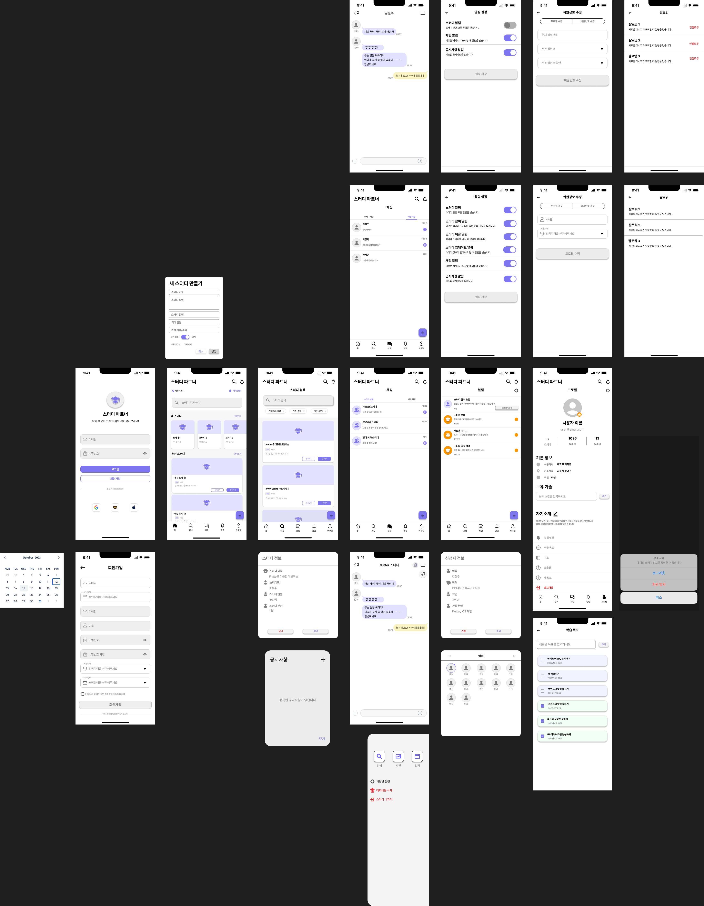

# 스터디 파트너 프론트엔드

스터디 파트너 매칭 서비스의 Flutter 웹 애플리케이션입니다.

## 📋 프로젝트 개요

스터디 파트너는 사용자들이 스터디 그룹을 만들고 참여할 수 있는 매칭 플랫폼입니다. 이 프론트엔드 애플리케이션은 직관적인 UI/UX를 통해 사용자들이 쉽게 스터디를 찾고 참여할 수 있도록 도와줍니다.

## 🎨 디자인 시스템

### UI/UX 디자인
아래는 Figma를 통해 설계된 애플리케이션의 전체 화면 구성과 사용자 플로우입니다:



**주요 디자인 특징:**
- **Material Design 3** 기반의 모던한 UI
- **반응형 웹 디자인**으로 다양한 화면 크기 지원
- **직관적인 네비게이션**과 사용자 친화적인 인터페이스
- **일관된 색상 체계**와 타이포그래피
- **접근성을 고려한 UI 컴포넌트** 설계

## 🛠 기술 스택

- **Framework**: Flutter 3.27.1
- **Language**: Dart 3.2.3
- **State Management**: StatefulWidget (기본 상태 관리)
- **HTTP Client**: Dio
- **Routing**: GoRouter
- **UI Components**: Material Design 3
- **Platform**: Web (Chrome, Safari, Firefox 지원)

## 📦 주요 의존성

```yaml
dependencies:
  flutter:
    sdk: flutter
  go_router: ^14.6.1
  dio: ^5.7.0
  shared_preferences: ^2.3.3
  flutter_secure_storage: ^9.2.2
  image_picker: ^1.1.2
  cached_network_image: ^3.4.1
  flutter_map: ^7.0.2
  latlong2: ^0.9.1
  geolocator: ^13.0.1
  permission_handler: ^11.3.1
  intl: ^0.19.0
```

## 🚀 설치 및 실행

### 필수 요구사항

- Flutter SDK 3.27.1 이상
- Dart SDK 3.2.3 이상
- Chrome 브라우저 (개발 및 테스트용)

### 실행 방법

1. **프로젝트 클론**
   ```bash
   git clone <repository-url>
   cd likelion_front
   ```

2. **의존성 설치**
   ```bash
   flutter pub get
   ```

3. **웹 서버 실행**
   ```bash
   flutter run -d web-server --web-port 3000
   ```

4. **Chrome에서 실행**
   ```bash
   flutter run -d chrome
   ```

5. **애플리케이션 확인**
   - 웹 주소: http://localhost:3000
   - 개발자 도구를 통한 반응형 테스트 가능

## 🏗 프로젝트 구조

```
lib/
├── main.dart                    # 앱 진입점 및 라우팅 설정
├── models/                      # 데이터 모델
│   ├── notification.dart
│   └── study.dart
├── screens/                     # 화면 컴포넌트
│   ├── home_screen.dart         # 홈 화면
│   ├── login_screen.dart        # 로그인 화면
│   ├── register_screen.dart     # 회원가입 화면
│   ├── profile_screen.dart      # 프로필 화면
│   ├── profile_edit_screen.dart # 프로필 수정
│   ├── study_create_screen.dart # 스터디 생성
│   ├── study_detail_screen.dart # 스터디 상세
│   ├── study_search_screen.dart # 스터디 검색
│   ├── chat_screen.dart         # 채팅 목록
│   ├── chat_room_screen.dart    # 채팅방
│   ├── notification_screen.dart # 알림 화면
│   ├── notification_settings_screen.dart # 알림 설정
│   ├── map_screen.dart          # 지도 화면
│   ├── follow_screen.dart       # 팔로우 화면
│   └── user_info_screen.dart    # 사용자 정보
├── services/                    # API 서비스
│   ├── api_service.dart         # HTTP API 클라이언트
│   └── auth_service.dart        # 인증 서비스
├── widgets/                     # 재사용 가능한 위젯
│   └── location_selector.dart   # 위치 선택 위젯
└── router.dart                  # 라우팅 설정
```

## 🎨 주요 화면 및 기능

### 🏠 홈 화면 (HomeScreen)
- **지역 선택**: 위치 기반 스터디 필터링
- **검색 기능**: 스터디 검색 및 필터링
- **내 스터디**: 참여 중인 스터디 목록 (가로 스크롤)
- **추천 스터디**: 추천 스터디 목록 (세로 스크롤)
- **플로팅 버튼**: 새 스터디 생성

### 🔐 인증 시스템
- **로그인**: OAuth 로그인 지원 (Google)
- **회원가입**: 기본 정보 입력 및 약관 동의
- **자동 로그인**: JWT 토큰 기반 세션 관리

### 👤 프로필 관리
- **프로필 조회**: 기본 정보, 보유 기술, 자기소개
- **프로필 수정**: 개인 정보 및 기술 스택 업데이트
- **설정**: 알림 설정, 로그아웃

### 📚 스터디 관리
- **스터디 생성**: 제목, 설명, 카테고리, 일정 등 설정
- **스터디 상세**: 상세 정보, 참여자 목록, 참여/탈퇴 기능
- **스터디 검색**: 카테고리, 지역, 키워드 기반 검색
- **참여 관리**: 스터디 참여 신청 및 탈퇴

### 💬 소통 기능
- **채팅**: 스터디 그룹 채팅 (UI 구현)
- **알림**: 스터디 관련 알림 시스템
- **팔로우**: 사용자 팔로우 기능

### 🗺 부가 기능
- **지도**: 스터디 위치 표시 및 주변 검색
- **위치 서비스**: 현재 위치 기반 서비스

## 🎯 주요 기능 상세

### 1. 라우팅 시스템 (GoRouter)
```dart
// 주요 라우트 설정
- '/' : 홈 화면
- '/login' : 로그인
- '/register' : 회원가입
- '/profile' : 프로필
- '/study/create' : 스터디 생성
- '/study/detail/:id' : 스터디 상세
- '/search' : 검색
- '/chat' : 채팅
- '/notifications' : 알림
```

### 2. API 통신 (Dio)
```dart
class ApiService {
  // 스터디 관련 API
  Future<Map<String, dynamic>> getStudies()
  Future<Map<String, dynamic>> createStudy(StudyCreateRequest request)
  Future<Map<String, dynamic>> joinStudy(int studyId)
  Future<Map<String, dynamic>> leaveStudy(int studyId)
  
  // 사용자 관련 API
  Future<Map<String, dynamic>> login(String email, String password)
  Future<Map<String, dynamic>> oauthLogin(String provider, String email, String name)
}
```

### 3. 상태 관리
- **StatefulWidget**: 기본 상태 관리
- **setState()**: 로컬 상태 업데이트
- **Future/async**: 비동기 데이터 처리

### 4. 반응형 디자인
- **Material Design 3**: 최신 디자인 가이드라인
- **Responsive Layout**: 다양한 화면 크기 지원
- **Adaptive UI**: 플랫폼별 최적화

## 🔧 설정 및 환경

### 환경 설정 파일
```
assets/
├── config.env              # 환경 변수 설정
└── icons/                  # 앱 아이콘
    └── kakao.png
```

### 웹 설정
```html
<!-- web/index.html -->
<meta name="viewport" content="width=device-width, initial-scale=1.0">
<title>스터디 파트너</title>
```

## 🧪 테스트

### 단위 테스트
```bash
flutter test
```

### 통합 테스트
```bash
flutter drive --target=test_driver/app.dart
```

### 웹 테스트
```bash
flutter test --platform chrome
```

## 📱 빌드 및 배포

### 웹 빌드
```bash
flutter build web
```

### 배포용 빌드
```bash
flutter build web --release
```

### 정적 파일 서빙
```bash
# Python 서버 (테스트용)
cd build/web
python -m http.server 8000

# Node.js 서버 (테스트용)
npx serve build/web
```

## 🎨 UI/UX 디자인

### 디자인 시스템
- **컬러 팔레트**: Primary Blue, Secondary Colors
- **타이포그래피**: Material Design 3 텍스트 스타일
- **아이콘**: Material Icons + Custom Icons
- **레이아웃**: Card-based Design, Grid System

### 주요 컴포넌트
- **StudyCard**: 스터디 정보 카드
- **LocationSelector**: 위치 선택 드롭다운
- **CategoryChip**: 카테고리 칩
- **CustomAppBar**: 커스텀 앱바

## 🔍 개발 도구

### 디버깅
```bash
# 웹 디버깅
flutter run -d chrome --debug

# 핫 리로드
r (hot reload)
R (hot restart)
```

### 성능 분석
```bash
# 성능 프로파일링
flutter run --profile -d chrome

# 빌드 분석
flutter build web --analyze-size
```

## 📝 개발 노트

### 주요 개발 결정사항
1. **웹 우선 개발**: 모바일 앱 확장 가능한 구조
2. **Material Design 3**: 일관된 디자인 시스템
3. **GoRouter**: 선언적 라우팅
4. **Dio**: HTTP 클라이언트 표준화

### 알려진 이슈
1. **브라우저 호환성**: Chrome 최적화, Safari/Firefox 부분 지원
2. **모바일 반응형**: 터치 이벤트 최적화 필요
3. **성능**: 대용량 리스트 가상화 필요

### 향후 개선사항
1. **상태 관리**: Provider/Bloc 패턴 도입
2. **오프라인 지원**: 캐싱 및 동기화
3. **PWA**: 프로그레시브 웹 앱 기능
4. **테스트**: 단위/통합 테스트 커버리지 확대

## 🤝 기여 방법

1. Fork the repository
2. Create a feature branch (`git checkout -b feature/amazing-feature`)
3. Commit your changes (`git commit -m 'Add amazing feature'`)
4. Push to the branch (`git push origin feature/amazing-feature`)
5. Open a Pull Request

### 코딩 규칙
- Dart 공식 스타일 가이드 준수
- 컴포넌트 분리 및 재사용성 고려
- 주석 및 문서화 작성

## 📄 라이선스

이 프로젝트는 MIT 라이선스 하에 배포됩니다.

## 📞 문의

프로젝트에 대한 문의사항이 있으시면 이슈를 등록해주세요.

---

**Made with ❤️ using Flutter**
